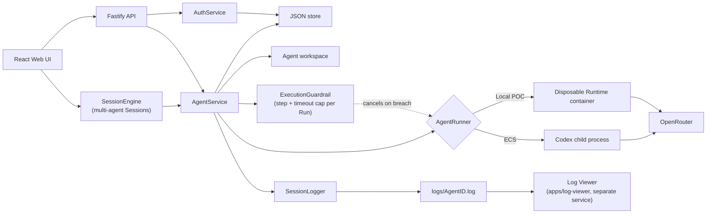

# Architecture

Volc Agent Launchpad is a single-node control plane for hackathon use.



## Components

### Web UI

Lists the logged-in user's own Agents, manages lifecycle actions, submits
prompts, and polls asynchronous Runs. It never receives the OpenRouter API
key.

### Fastify API

Validates requests, resolves the bearer token on every `/api/*` request to a
`User` via `AuthService` (401 otherwise), and serves the compiled Web UI.
`request.userId` is then threaded through `AgentService`/`SessionEngine` so
every Agent lookup is scoped to its owner, and every Session lookup to its
owner or collaborators — 404 for no access at all (existence isn't leaked),
403 for an owner-only action (roster/collaborator management, delete)
attempted by a collaborator who does have access to the Session itself.

### AuthService

Owns `User` and `AuthToken` records in the JSON store: `createUser` (used by
both `POST /api/auth/register`, self-service, and the `npm run create-user`
CLI script for out-of-band provisioning), `register` (create + immediately
log in), `login`/`logout`, and `resolveToken`. Passwords are hashed with
`scrypt`; bearer tokens are random and stored only as a SHA-256 hash, with a
30-day expiry. Signup has no invite/approval gate — anyone who can reach the
server can create an account (see [SECURITY.md](../SECURITY.md)).

### AgentService

Coordinates lifecycle state, persistence, workspaces, and Runs, scoped by
`Agent.ownerId`. One Agent can have only one active Run. Every Run is
wrapped in an `ExecutionGuardrail`
([middleware/execution-guardrail.ts](../apps/server/src/middleware/execution-guardrail.ts))
that counts tool-call events against `Agent.maxExecutionSteps` and enforces
`Agent.maxExecutionTimeoutMs`; crossing either cancels the Run via the
Runner and marks it `failed`.

```text
ready -> busy -> ready
  |       |
  v       v
stopped  error
```

Interrupted Runs become `cancelled` after a restart.

### Storage

```text
data/launchpad.json       Agent, message, and Run metadata
workspaces/AgentID/       Agent-created files
workspaces/.deleted/      Archived deleted workspaces
codex-home/               Codex configuration and sessions
```

`JsonStore` serializes writes and atomically replaces one JSON file. It supports
one process only.

### Runtime providers

- `CodexRunner` runs Codex inside the application container for ECS.
- `ContainerCodexRunner` starts one disposable Docker, Colima, or Podman
  container for every local turn.

Both providers use argv-only process execution, bound output and time, resume
the stored Codex thread, and escalate termination after a grace period.

### Session logging

`SessionLogger` appends a redacted JSONL entry — user message, tool call,
agent response, or error — to `logs/AgentID.log` for every Run, keyed by
Agent (a "session" is one Agent's whole conversation). Every entry carries
the owning Agent's `ownerId` (the `User.id` that created it, `null` for
pre-login rows) so a log line can be traced back to a user, though reading
the logs is not itself access-controlled per user (see
[SECURITY.md](../SECURITY.md)). `AgentRunner` implementations report
tool-call and error events as they parse Codex's `--json` stream, via an
optional `onEvent` callback on `RunnerRequest`. The
`apps/log-viewer` package is a separately hosted, minimal Fastify service
that reads the same `LOGS_DIR` and serves a small static UI for listing
sessions and filtering one by keyword — it has no dependency on the main
server or its API. See [SESSION_LOGGING.md](SESSION_LOGGING.md) for the full
data flow, file format, and redaction rules.

### Multi-agent Sessions

A `Session` holds a roster of existing Agents and is fronted by a hidden
**orchestrator** Agent (`SessionEngine`) that decomposes an incoming request
into subtasks and delegates each one to the right roster member, then
synthesizes their results into one answer. Only Agents added to a Session's
roster can ever be routed to — enforced in `SessionEngine`, not the UI —
and a Session's activity (separate Codex thread, separate message history)
never appears in an Agent's own Playground conversation. A Session can also
have **collaborators** (`Session.collaboratorIds`) — other users with full
read/participate access (including a `kind: "comment"` channel for
human-to-human asides that bypasses the turn-taking state machine
entirely). The roster itself can hold Agents contributed by *any* Session
member, not just the owner — each stays strictly single-owner in
`AgentService`, but a Session's response denormalizes every roster Agent's
name/status/contributing username so a collaborator can see (read-only)
Agents they don't personally own. Only the owner can manage the
collaborator list or delete the Session. Every Agent write to a Session's
shared workspace directory is serialized session-wide (`pumpQueue`
dispatches one subtask at a time), since there's no file locking — this
matters more now that a roster can span multiple contributors. See
[MULTI_AGENT_SESSIONS.md](MULTI_AGENT_SESSIONS.md) for the full turn
lifecycle, the sender/recipient message model, and known
limitations.

## Deployment profiles

| Profile | Control plane | Agent execution |
| --- | --- | --- |
| Local POC | Host Node.js | Disposable local container |
| ECS | Application container | Codex process in the same container |
| Local development | Host Node.js | Host Codex process |

## Extension seams

| Track | Primary seam | Expected change |
| --- | --- | --- |
| Glass Box | `AgentRunner`, `AgentRun` | Emit and display correlated execution events. |
| Bouncer | `AuthService`, RBAC | Login, self-service signup, per-owner Agent scoping, and Session collaborators exist; add Agent-level sharing beyond clone, invite-gated signup, and per-user log access. |
| Kill Switch | `AgentService`, `ExecutionGuardrail` | Per-Run step and timeout caps now cancel a runaway Run (see `middleware/execution-guardrail.ts`). A role-based policy engine (`authorization.middleware.ts`, `agent-identity.ts`) also exists in the tree but is **not yet called from any route, service, or Runner** — wiring `executeProtectedAction()` into `AgentService.executeRun`'s `onEvent` handler, the same seam the guardrail already uses, is the natural next step. |

The current container or ECS instance is the POC trust boundary. Ordinary
containers are not hardened multi-tenant isolation.
