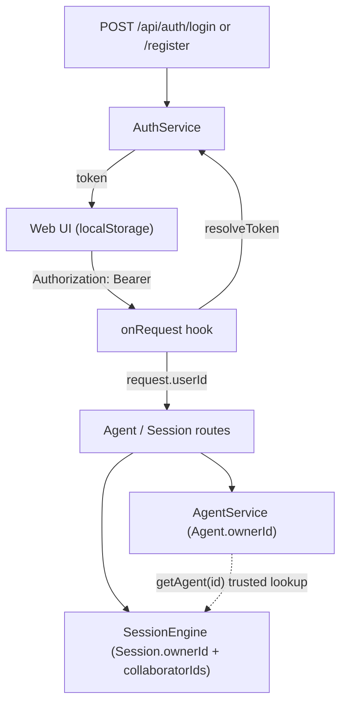

# Multi-user login, ownership, sharing, and collaboration

This document covers everything added to turn Volc Agent Launchpad from a
single-user proof of concept into a multi-user one: accounts and login,
per-owner scoping of Agents and Sessions, clone-based Agent sharing, and
live multi-user collaboration on multi-agent Sessions. It's a companion to
[ARCHITECTURE.md](ARCHITECTURE.md) (component overview) and
[MULTI_AGENT_SESSIONS.md](MULTI_AGENT_SESSIONS.md) (the orchestration engine
itself) — this doc goes deep on the identity/access layer wrapped around them.



## 1. Authentication

### Data model

`apps/server/src/types.ts`:

```ts
interface User {
  id: string;
  username: string;
  passwordHash: string;   // "scrypt:<saltHex>:<hashHex>"
  createdAt: string;
}

interface AuthToken {
  tokenHash: string;      // sha256 hex digest — the raw token is never persisted
  userId: string;
  createdAt: string;
  expiresAt: string;      // 30 days from issuance
}
```

Both live in the same `JsonStore`-backed `Database` as everything else
(`Database.version` is `3`; `users`/`authTokens` were added in the v2→v3
migration in [store.ts](../apps/server/src/store.ts), alongside
`ownerId`/`collaboratorIds` being backfilled as `null`/absent on existing
rows).

### Password and token handling — `apps/server/src/auth.ts`

No new npm dependency was added for any of this — it's all `node:crypto`,
matching the style already used elsewhere in the server (`timingSafeEqual`,
`randomUUID`):

- `hashPassword`/`verifyPassword` — `scryptSync` with a random 16-byte salt
  per user; the scheme/salt/hash are concatenated into one string so
  verification is self-contained (no separate salt column).
- `generateToken()` — `randomBytes(32).toString("base64url")`, an opaque
  bearer token.
- `hashToken()` — `sha256` hex digest. Only this hash is ever written to
  disk; a leaked `data/launchpad.json` can't be used to forge a session.
- `AuthService`:
  - `createUser(username, password)` — trims/validates (non-empty username,
    ≥8-char password), rejects a duplicate username with `409`.
  - `register(username, password)` — `createUser` + `login` in one call;
    backs the self-service `POST /api/auth/register` route.
  - `login(username, password)` — verifies the password, mints a token,
    stores its hash with a 30-day `expiresAt`.
  - `resolveToken(token)` — hashes the candidate, looks it up, checks
    expiry; returns `null` (not a throw) on any failure so callers can
    decide what a missing/expired token means.
  - `logout(token)` — deletes the matching `authTokens` row.
  - `getUserById` / `getUserByUsername` — used throughout `app.ts` to
    resolve ids ↔ usernames for display and for the "add by username" flows
    (Agent sharing, Session collaborators).

### Provisioning: two paths, one validation

- **Self-service**: `POST /api/auth/register` — open to anyone who can
  reach the server, no invite/approval step (see
  [SECURITY.md](../SECURITY.md) for the implication of that on a
  network-reachable deployment).
- **Admin/CLI**: `apps/server/src/scripts/create-user.ts`
  (`npm run create-user -w @launchpad/server -- <user> <pass>`) opens the
  same `JsonStore` directly and calls `AuthService.createUser`. Must be run
  with the server process stopped — `JsonStore` caches the whole database
  in memory and is single-process, so a write from the script while the
  server is also running can be silently overwritten on the server's next
  save.

Both paths go through the exact same `createUser` validation, so there's
one password/username policy regardless of how an account was made.

### Request authentication — `apps/server/src/app.ts`

One global `onRequest` hook gates every `/api/*` route except
`/api/health`, `/api/auth/login`, and `/api/auth/register`:

```ts
const header = request.headers.authorization ?? "";
const token = header.startsWith("Bearer ") ? header.slice(7) : "";
const user = token ? await auth.resolveToken(token) : null;
if (!user) return reply.code(401).send({ error: "Authentication required" });
request.userId = user.id;
```

`request.userId` (added to Fastify's request type via a `declare module
"fastify"` augmentation at the top of `app.ts`) is then threaded as a plain
string into every `AgentService`/`SessionEngine` call — those two classes
have no dependency on `AuthService` at all; they just take an id and decide
access by comparing it to a stored `ownerId`/`collaboratorIds`. Username
resolution (for display, or for "add by username" flows) happens only in
`app.ts`, which is the one place that holds a reference to `AuthService`.

### Client-side token storage — `apps/web/src/App.tsx` / `api.ts`

The token is kept in a module-level variable in `api.ts` (set via
`setAuthToken`) and persisted to `localStorage` under
`launchpad.authToken` so a page reload doesn't force a fresh login. On
mount, the app reads that key, calls `GET /api/auth/me` to confirm it's
still valid, and either restores the session or falls back to the login
screen.

**This means two tabs of the *same* browser profile share one login** —
`localStorage` is per-origin, not per-tab. Logging in as a different user
in one tab overwrites the token the other tab will see on its next load.
Testing or using two genuinely independent, simultaneous sessions on one
machine requires separate browser profiles, an incognito/private window,
or a different device — each of those gets isolated storage. This is a
client-storage choice, not a server limitation: the server has no concept
of "browser" or "tab" at all, only whatever bearer token a request carries.

## 2. Per-owner scoping (Agents and Sessions)

### The shared convention

`Agent.ownerId` and `Session.ownerId` are `string | null` (`null` only for
rows that predate accounts, from the v2→v3 migration). Every lookup method
on `AgentService`/`SessionEngine` takes an `ownerId?`/`callerId?` parameter
with one convention throughout:

- **`undefined`** — internal/trusted call (the engine's own background
  bookkeeping calling itself), skip the check entirely.
- **a real value** — enforce it. Always **404**, never 403, when the
  requester has no relationship to the resource at all — a stranger
  shouldn't be able to learn a resource exists by getting a different error
  code for "doesn't exist" vs. "exists but isn't yours".

`apps/server/src/errors.ts`:

```ts
export function assertOwned(
  resourceOwnerId: string | null,
  requestedOwnerId: string | null | undefined,
  notFoundMessage: string,
): void {
  if (requestedOwnerId !== undefined && resourceOwnerId !== requestedOwnerId) {
    throw new HttpError(404, notFoundMessage);
  }
}
```

`AgentService.getAgent(id, ownerId?)` is the choke point essentially every
other Agent method (`getMessages`, `getRuns`, `updateAgent`, `deleteAgent`,
`stopAgent`/`startAgent` via the private `setStatus`, `sendMessage`) calls
through, so the check lives in one place. `SessionEngine.getSession(id,
callerId?)` plays the same role for Sessions, but with a richer predicate
(see §4) since a Session can have more than one authorized user.

### Route wiring pattern

Every Agent/Session route in `app.ts` follows the same shape: parse
params/body with zod, then pass `request.userId` straight through as the
last argument:

```ts
app.get("/api/agents/:id", async (request) => {
  const { id } = agentIdParams.parse(request.params);
  return { agent: service.getAgent(id, request.userId) };
});
```

No route ever computes an authorization decision itself — it's always
delegated to the service/engine method, so the access rule lives in exactly
one place per resource type.

## 3. Agent sharing — clone, not live access

Sharing an Agent (`POST /api/agents/:id/share`, body `{ username }`) copies
its `name`/`description`/`instructions` into a **brand-new** Agent owned by
the recipient — fresh id, fresh workspace directory, fresh Codex thread, no
shared conversation history with the original.

```ts
// apps/server/src/agent-service.ts
async shareAgent(id: string, ownerId: string, targetUserId: string): Promise<Agent> {
  const source = this.getAgent(id, ownerId);           // must own the source
  if (source.kind === "orchestrator") {
    throw new HttpError(400, "An orchestrator Agent cannot be shared");
  }
  return this.createAgent(
    { name: source.name, description: source.description, instructions: source.instructions },
    targetUserId,
  );
}
```

This was a deliberate choice over "live shared access to the same Agent
record" for two reasons:

1. **No new access-control model needed.** A clone is just a normal
   `createAgent` call under a different owner — it doesn't touch
   `assertOwned`/`getAgent` at all, so none of the existing ownership
   enforcement needed to change.
2. **Sidesteps a real concurrency problem.** `AgentService` allows only one
   active Run per Agent (`activeExecutions`), and a Runner's execution
   writes into that Agent's single workspace directory. Two people running
   turns against the *same* Agent record at once would either serialize
   awkwardly or race on the filesystem. A clone gives each recipient their
   own workspace and run slot for free.

The tradeoff, stated plainly: it's a snapshot. Editing the original later
never propagates to a clone.

## 4. Multi-user collaborative Sessions

This is the deepest part of the feature set — a Session can now have, on
top of its single `ownerId`, a list of **collaborators** with real
participation rights, and its Agent roster can be contributed to by more
than one of them.

### Access tiers

`apps/server/src/session-engine.ts`:

```ts
function hasSessionAccess(session: Session, callerId: string | null | undefined): boolean {
  if (callerId === undefined) return true; // internal/trusted call
  return session.ownerId === callerId || (session.collaboratorIds ?? []).includes(callerId ?? "");
}

function assertIsOwner(session: Session, callerId: string | null | undefined): void {
  if (callerId !== undefined && session.ownerId !== callerId) {
    throw new HttpError(403, "Only the Session owner can do this");
  }
}
```

Two tiers, two different status codes:

| Who | Can do | On failure |
| --- | --- | --- |
| Owner or collaborator ("has access") | read the Session, send task messages and comments, stop it | stranger → **404** (existence hidden) |
| Owner only | delete the Session, manage the collaborator list | collaborator → **403** (they legitimately know it exists) |
| Any Session member | manage the Agent roster (see below) | — |

`getSession(id, callerId?)` (line 122) is the choke point for the
has-access check, exactly like `AgentService.getAgent` is for Agents.
`assertIsOwner` is layered on top of it for the two genuinely owner-only
actions: `deleteSession` (line 289) and `updateCollaborators` (line 239).

`listSessions(callerId)` (line 133) filters with the same
`hasSessionAccess` predicate, so `GET /api/sessions` naturally returns
"Sessions I own or collaborate on," not just "Sessions I own."

### Managing collaborators

`PATCH /api/sessions/:id/collaborators`, owner-only, body `{ add?, remove?
}` of **usernames** (resolved to ids in `app.ts` via
`auth.getUserByUsername`, mirroring the Agent-share flow) —
`updateCollaborators` (line 239) mirrors `updateMembers`'s add/remove-set
`store.mutate` shape exactly, just against `collaboratorIds` instead of
`memberAgentIds`.

### The roster is multi-owner

This went through two iterations. The first cut kept the Agent roster
locked to the Session's creator only — collaborators got full
conversational access but couldn't contribute their own Agents, and
(a bug caught during review) couldn't even see the *names* of roster
Agents they didn't own, since the client was resolving names against the
viewer's own Agent list. Both were fixed together:

**Any Session member can contribute their own Agents** —
`updateMembers` (line 199) now takes the caller's id and enforces two
different rules for `add` vs `remove`:

```ts
async updateMembers(id, add = [], remove = [], callerId?) {
  const session = this.getSession(id, callerId);       // must have access at all
  for (const agentId of add) {
    const agent = this.agents.getAgent(agentId, callerId); // must own what you add
    if (agent.kind === "orchestrator") throw new HttpError(400, "...");
  }
  for (const agentId of remove) {
    if (callerId !== undefined && callerId !== session.ownerId) {
      // non-owners may only remove Agents they themselves contributed
      const agent = this.agents.getAgent(agentId);          // trusted lookup
      if (agent.ownerId !== callerId) throw new HttpError(403, "...");
    }
  }
  // ...apply to memberAgentIds
}
```

So: add is gated by "do you own this Agent", remove is gated by "did you
contribute this Agent, or are you the Session owner (who can remove
anyone's)". A collaborator can freely toggle their own Agents in and out;
they can't unilaterally evict someone else's.

**Roster Agents are visible to everyone with Session access, regardless of
ownership** — but only for *display*, not for any other access. `app.ts`'s
`enrichSession` helper resolves each `memberAgentIds` entry via a
**trusted** `service.getAgent(id)` call (no ownerId argument — this is the
one place outside `SessionEngine` itself that deliberately uses the
trusted/skip-check form) and attaches name/status/contributing username to
the Session response:

```ts
const members = session.memberAgentIds.map((id) => {
  const agent = service.getAgent(id); // trusted — display only
  return {
    id: agent.id, name: agent.name, status: agent.status,
    ownerId: agent.ownerId,
    ownerUsername: agent.ownerId ? auth.getUserById(agent.ownerId)?.username ?? null : null,
  };
});
```

This never grants access to the underlying Agent record itself — a
collaborator still can't `GET /api/agents/:id` for someone else's
contributed Agent, edit it, or message it directly outside the Session.
They can only see its name/status/owner through the Session's own
response, and only because they already have legitimate access to that
Session.

**Internal dispatch had to stop assuming one owner.** Before collaborators
could contribute Agents, every internal call from `SessionEngine` into
`AgentService` for a *member* Agent used `session.ownerId` as the ownerId
argument — safe when the roster really was single-owner. Once it wasn't,
that would incorrectly 404 a collaborator's own Agent the moment the
orchestrator tried to actually use it. Fixed by switching those specific
calls to trusted (no-ownerId) lookups, since roster membership is already
the authorization by the time dispatch happens:

- `resolveMembers` (line ~373) — `this.agents.getAgent(agentId)` (was
  `..., session.ownerId`).
- `dispatchSubtask` (line 484) — `this.agents.sendMessage(agentId, task,
  undefined, {...})` (was `..., session.ownerId, {...}`).
- `stopSession`'s busy-Agent cleanup loop (line ~261) — `stopAgent(agentId)`
  with no ownerId.

Calls that really are always about the Session's own orchestrator (which
*is* always owned by `session.ownerId` — it's created at Session-creation
time and never reassigned) were left untouched:
`dispatchOrchestratorTurn`'s `sendMessage(orchestratorId, ..., session.ownerId,
...)`, and `deleteSession`'s `deleteAgent(session.orchestratorAgentId,
session.ownerId)`.

**The orchestrator itself is ownership-blind.** The roster prompt built in
`dispatchDecompose` (line 387) lists each member Agent's `id`/`name`/
`description` only — no owner information — and the only check when a
decomposition comes back (`handleOrchestratorSettled`, line 557) is
`memberIds.has(subtask.agentId)`. Concretely: a single request from either
user can get decomposed into subtasks assigned to Agents from *both*
owners, and a request from one collaborator can be routed to another
collaborator's contributed Agent — there's no "only route to your own
Agent" restriction once something is in the roster. If owner-aware routing
is ever wanted, the roster prompt would need the contributing username
added to each line.

### Concurrency

Two independent mechanisms, addressing two different risks:

**Human-initiated task turns are serialized per Session**, and this was
already true before collaboration existed: `handleUserMessage` (line 302)
rejects with `409` unless `session.stage === "idle"`. With multiple humans
in one Session, this means whoever's request is in flight blocks a new
task message from *anyone*, owner or collaborator alike — there's no
per-user queue, just a flat "one turn at a time, session-wide" rule. A
rejected sender has to retry once it's idle again.

**Agent-to-agent workspace writes are now explicitly serialized
session-wide**, which is a real fix, not just a restatement of the above.
Every Agent in a Session — orchestrator and every member, regardless of
who owns them — shares one workspace directory
(`workspaceOverride: session.workspacePath` on every turn). The original
`pumpQueue` dispatched one subtask *per distinct Agent* that wasn't already
busy, so two different member Agents' Codex processes could run
concurrently against that shared directory with no file locking — a latent
bug that predates multi-owner rosters but became more likely to bite once
more people are actively driving a Session. Fixed by dispatching **one
subtask at a time, full stop**:

```ts
// apps/server/src/session-engine.ts, line 527
private async pumpQueue(sessionId: string): Promise<void> {
  const queue = this.queuedSubtasks.get(sessionId) ?? [];
  if (queue.length === 0) return;
  const session = this.getSession(sessionId);
  if (session.pendingSubtasks.length > 0) return; // something already mid-turn
  const [subtask, ...remaining] = queue;
  if (!subtask) return;
  this.queuedSubtasks.set(sessionId, remaining);
  await this.dispatchSubtask(session, subtask);
}
```

`maybeAdvanceAfterSettle` (line 655) calls `pumpQueue` again every time a
subtask settles, which drains the rest of the queue one at a time. The
tradeoff is real: subtasks that could theoretically have run in parallel
now run sequentially, so a round with several delegated subtasks takes
longer wall-clock time. In exchange, there's no concurrent-write race on
the shared workspace, which matters more now that a roster can span
multiple contributors' Agents.

### Human-to-human comments

Answers a direct ask: a way for collaborators to talk to each other in a
Session without triggering agent work. A `Message` can now be a
`kind: "comment"` instead of the implicit `"task"` default — a comment
**never touches `stage`** and is therefore never blocked by the 409 above,
even mid-run:

```ts
// apps/server/src/session-engine.ts, line 346
async postComment(sessionId, content, callerId, senderUsername?) {
  const session = this.getSession(sessionId, callerId); // same access check as handleUserMessage
  const comment: Message = {
    id: randomUUID(), agentId: session.orchestratorAgentId, runId: randomUUID(),
    role: "user", content, sessionId, kind: "comment",
    senderId: USER_PARTY,           // same sentinel as a task message
    senderUserId: callerId, senderUsername,
    createdAt: now(),
    // no recipientId — that's what distinguishes it from a task message,
    // whose recipientId is always the orchestrator's Agent id
  };
  await this.store.mutate((db) => db.messages.push(comment));
  return { message: comment };
}
```

Keeping `senderId: USER_PARTY` (rather than the real user id) was
deliberate: the web UI's `isUserFacing()` filter already treats
`senderId === USER_PARTY` as "show this by default," so a comment falls
into the existing visible-by-default bucket for free, with zero changes to
that filter.

`POST /api/sessions/:id/messages` picked up an optional `kind: "task" |
"comment"` body field (default `"task"`) and branches between
`handleUserMessage` and `postComment` — one endpoint, one composer, rather
than a separate route/screen. The web composer got a small Task/Comment
toggle next to the textarea; in Comment mode the send button is never
disabled by `stage !== "idle"`.

### Per-human message attribution

Before this, every human turn in a Session was labeled "You" for every
viewer, because `Message.senderId` was always the generic `USER_PARTY`
sentinel — there was no way to tell collaborators apart. Fixed additively,
without touching the sentinel scheme:

- `Message.senderUserId?: string` and `Message.senderUsername?: string` —
  stamped by both `handleUserMessage` and `postComment` from the caller's
  resolved identity, denormalized (username baked in at write time) the
  same way `SessionLogger` already denormalizes `agentName` — no
  cross-service lookup needed to render it later.
- Web: `partyLabel` (`apps/web/src/App.tsx`) now takes the message's
  `senderUserId`/`senderUsername` and the viewer's own `currentUser.id`:
  shows "You" when they match, the real username otherwise, and falls back
  to the old "You" behavior for messages that don't carry these fields at
  all (Playground messages, or Session rows written before this existed).

### Keeping the transcript live — and a regression it caused

Before collaboration, `pollSessionStage` only polled while a Session's
`stage` was actively working, and stopped the instant it went idle. That
made sense for a single user watching their own request, but it meant a
second collaborator looking at an already-idle Session would never see a
new message appear without manually reselecting it. Fixed by making the
poll loop run for as long as the Session stays selected — not just while
it's active — at a stage-dependent interval (900ms while working, a
gentler 3000ms while idle):

```ts
while (mountedRef.current && selectedSessionIdRef.current === sessionId) {
  const { session } = await api.getSession(sessionId);
  // ...update state, refresh messages...
  const delay = session.stage === "idle" || session.stage === "failed" ? 3000 : 900;
  await new Promise((resolve) => window.setTimeout(resolve, delay));
}
```

This surfaced a real regression: `refreshSessionMessages` called
`setSessionMessages(result.messages)` unconditionally on every tick. Since
that's a fresh array from the API response every time, React treated it as
a state change even when the content was byte-for-byte identical, which
re-ran the auto-scroll `useEffect` (keyed on `sessionMessages`) — the chat
view would jump to the bottom every 900ms–3000ms even with nothing new to
show. Fixed by comparing the fetched result against current state and
keeping the same array reference when nothing actually changed:

```ts
setSessionMessages((current) =>
  current.length === result.messages.length && JSON.stringify(current) === JSON.stringify(result.messages)
    ? current
    : result.messages,
);
```

## 5. API reference

| Route | Auth | Notes |
| --- | --- | --- |
| `POST /api/auth/register` | none | self-service signup, ≥8-char password |
| `POST /api/auth/login` | none | |
| `POST /api/auth/logout` | bearer | |
| `GET /api/auth/me` | bearer | |
| `GET/POST /api/agents`, `GET/PATCH/DELETE /api/agents/:id` | owner only | 404 for anyone else |
| `POST /api/agents/:id/share` | owner of `:id` | body `{ username }`, 404 if unknown or not yours |
| `GET /api/sessions`, `POST /api/sessions` | owner+collaborators (list/read), any authenticated user (create) | list/response enriched with `collaborators`, `members`, `isOwner` |
| `GET /api/sessions/:id`, `POST .../stop`, `GET/POST .../messages` | owner or collaborator | 404 for anyone else |
| `PATCH /api/sessions/:id/members` | any Session member | add: must own the Agent; remove: must own it or be the Session owner |
| `PATCH /api/sessions/:id/collaborators`, `DELETE /api/sessions/:id` | owner only | 403 for a collaborator, 404 for anyone else |

## 6. Tests

- `apps/server/src/auth.test.ts` — password hashing round-trip, `register`,
  duplicate-username rejection, token issue/resolve/expiry/logout.
- `apps/server/src/agent-service.test.ts` — per-owner isolation, Agent
  sharing (clone independence, rejects sharing what you don't own, refuses
  sharing an orchestrator).
- `apps/server/src/session-engine.test.ts` — collaborator access tiers
  (404 vs 403), multi-owner roster (contribute/remove-your-own vs
  owner-can-remove-anyone's), cross-owner delegation actually dispatching
  correctly, comments bypassing `stage`, and single-flight subtask
  dispatch even across different Agents.
- `apps/server/src/app.test.ts` — the same behaviors at the HTTP boundary,
  plus the `enrichSession` response shape (a collaborator sees real names
  for Agents they don't own).

## 7. Known limitations

- No self-service password reset, and no way to delete/deactivate an
  account.
- No RBAC beyond owner-vs-collaborator; every collaborator has identical
  rights (participate + contribute Agents), there's no finer-grained role.
- A collaborator can't remove themselves from a Session — only the owner
  can change the collaborator list.
- No notification when someone adds you as a collaborator or shares an
  Agent with you; you discover it on your next list refresh.
- Human task turns are still a flat 409-on-busy, session-wide — no
  per-user request queue.
- No push updates (WebSocket/SSE) — the web UI polls, now including while
  idle, but there's no true "instant" propagation.
- The orchestrator can't make owner-aware routing decisions (see
  "The orchestrator itself is ownership-blind" above).
- Session logs (`logs/<agentId>.log`) are tagged with the owning Agent's
  `ownerId` but reading the logs themselves is still only gated by the
  separate, optional `LOG_VIEWER_AUTH_TOKEN` — not per-user.
