# Session Logging Architecture

This document explains how session-based logging works: what a "session" is,
how an entry gets from a Codex turn onto disk, the file format, and how the
separately hosted log viewer reads it back. See
[ARCHITECTURE.md](ARCHITECTURE.md) for how this fits into the rest of the
system.

## What a "session" is

A session is one Agent's whole conversation. `AgentRun`s already share a
`codexThreadId` across turns for a given Agent (`agent-service.ts`, see
`executeRun`), so an Agent's conversation is already the natural
continuity boundary in this codebase — a session log file is keyed by
`agentId`, and every Run for that Agent appends to the same file for the
Agent's lifetime.

```text
logs/<agentId>.log
```

One line per event, in the order it happened. Deleting an Agent does not
delete its log file — logs outlive the Agent the same way archived
workspaces do (`workspaces/.deleted/`), so a past conversation stays
inspectable.

## End-to-end flow

```mermaid
flowchart LR
    subgraph Server["apps/server"]
        Service["AgentService.sendMessage /\nexecuteRun"]
        Logger["SessionLogger"]
        Runner["CodexRunner /\nContainerCodexRunner"]
        Parse["parseCodexEventLine"]
    end

    Codex["codex exec --json\n(stdout stream)"] --> Parse
    Parse -->|onEvent callback| Runner
    Runner -->|onEvent callback| Service
    Service -->|logUserMessage\nlogToolCall\nlogAgentResponse\nlogError| Logger
    Logger -->|append JSONL| File["logs/AgentID.log"]

    subgraph Viewer["apps/log-viewer (separate service)"]
        Reader["SessionLogReader"]
        API["Fastify API"]
        UI["Static UI (public/app.js)"]
    end

    File -->|read-only| Reader
    Reader --> API
    API --> UI
```



Four points where a line gets written, all in
[agent-service.ts](../apps/server/src/agent-service.ts):

1. **User message** — `sendMessage()` logs the prompt right after the Run
   and Message are persisted, before execution starts.
2. **Tool calls** — `executeRun()` passes an `onEvent` callback into
   `runner.run(...)`. Both `CodexRunner` and `ContainerCodexRunner` invoke it
   from inside their stdout line-consumer, calling the shared
   `parseCodexEventLine()` (in
   [codex-runner.ts](../apps/server/src/codex-runner.ts)) with that callback.
   Every `item.completed` event whose item is not an `agent_message` (a
   `command_execution`, a `file_change`, etc.) is reported as a `tool_call`
   event **as Codex streams it**, not after the Run finishes — so a tool
   call is on disk even if the Run later times out or fails.
3. **Agent response** — logged once `runner.run()` resolves, using the same
   final output that becomes the assistant `Message`.
4. **Errors** — a `type: "error"` event from Codex's own stream is logged
   immediately via the same `onEvent` callback; a Run that throws (timeout,
   non-zero exit, cancellation) is logged once from the `catch` block in
   `executeRun()`.

`SessionLogger` methods are fire-and-forget (`void this.sessionLogger.log...`)
— a logging failure must never fail or delay a Run, so writes are not
awaited on the request's critical path and a write error is swallowed (see
the `try/catch` in `SessionLogger.write()`).

## The `RunnerEvent` seam

`RunnerRequest.onEvent` (in [types.ts](../apps/server/src/types.ts)) is the
only new surface added to the `AgentRunner` boundary:

```ts
export type RunnerEvent =
  | { kind: "tool_call"; itemType: string; status: string; summary: string; detail: unknown }
  | { kind: "error"; message: string };

export interface RunnerRequest {
  // ...existing fields...
  onEvent?: (event: RunnerEvent) => void;
}
```

It is optional, so every existing caller and test that builds a
`RunnerRequest` without it keeps working unchanged. `parseCodexEventLine()`
takes the callback as an optional third argument for the same reason — the
protocol-parsing tests that call it with two arguments still pass.

## File format

Each line is one JSON object (JSONL — one record per line, no wrapping
array, so a writer can always `appendFile` without reading the file first):

```json
{"ts":"2026-08-29T10:00:01.000Z","sessionId":"<agentId>","agentName":"Docs Bot","runId":"<runId>","type":"tool_call","itemType":"command_execution","status":"succeeded","summary":"npm test","detail":{"command":"npm test","exitCode":0}}
```

Common envelope on every line: `ts`, `sessionId` (the Agent id), `agentName`
(denormalized so the viewer never needs to call back into the main server or
its store), `runId`, `type`. The `type` determines the rest of the shape:

| `type` | Extra fields |
| --- | --- |
| `user_message` | `content` |
| `tool_call` | `itemType`, `status`, `summary`, `detail` |
| `agent_response` | `content`, `usage` |
| `error` | `message` |

### Redaction and truncation

Before a line is written, [session-logger.ts](../apps/server/src/session-logger.ts)
runs it through two guards:

- **`boundEntry()`** caps `content`/`summary`/`message` at 4,000 characters
  and, for `detail` (the raw Codex item, which can be arbitrarily large),
  replaces an oversized value with `{ truncated: true, preview: "..." }`.
  This is applied to individual fields — not the whole serialized line — so
  a line is always valid JSON even when truncated; a naive whole-line cutoff
  would risk leaving an unterminated JSON string that the reader would have
  to silently drop.
- **`redact()`** regex-strips `Bearer <token>`, `sk-or-...`-shaped OpenRouter
  keys, and generic 32+ character opaque tokens from the fully serialized
  line, replacing each with `[redacted]`. This runs last, after truncation,
  against the final JSON string — so it also catches a secret that ended up
  inside `detail` (e.g. a command echoing an env var).

This is pattern-based redaction, not a verified DLP system — treat it as a
best-effort safety net, the same caveat that applies to `APP_AUTH_TOKEN`
elsewhere in this repo (see [SECURITY.md](../SECURITY.md)).

## The log viewer is a separate service, on purpose

[apps/log-viewer](../apps/log-viewer) does not import anything from
`apps/server` and has no HTTP dependency on it — it only reads whatever is
in `LOGS_DIR`. That means:

- It can be built, deployed, scaled, and taken down independently of the
  main control plane (own `package.json`, own `Dockerfile.log-viewer`, own
  `docker-compose.yml` service).
- It never needs the `APP_AUTH_TOKEN` or `OPENROUTER_API_KEY` — its own
  optional `LOG_VIEWER_AUTH_TOKEN` gates its API the same way
  `APP_AUTH_TOKEN` gates the main API (shared bearer token,
  `timingSafeEqual` comparison).
- Losing it, restarting it, or pointing a different instance at the same
  `LOGS_DIR` has no effect on Agent Runs — it is a read-only observer.

The only coupling between the two services is the on-disk JSONL format
above and the shared `LOGS_DIR` path (or volume, in Docker Compose — see
`docker-compose.yml`, where both services mount `./logs`, the main app
read-write and the viewer read-only).

### `apps/log-viewer` internals

- `session-log-reader.ts` — `SessionLogReader.listSessions()` scans
  `LOGS_DIR` for `*.log` files and summarizes each one (entry count, first/
  last timestamp, per-type counts, the most recent `agentName` seen) without
  needing an index file — the log files are the only source of truth.
  `readEntries(sessionId, keyword?)` reads one file and, when a keyword is
  given, filters lines by a case-insensitive substring match against the
  entry's serialized JSON (so a keyword can match content, a tool summary,
  or an error message alike).
- `app.ts` — a small Fastify app: `GET /api/sessions`, `GET /api/sessions/:id?q=`,
  the shared-token auth hook, and `@fastify/static` serving `public/` (a
  single hand-written HTML/CSS/vanilla-JS page — no build step, consistent
  with this repo's "don't over-engineer the UI" stance elsewhere).
- `public/app.js` — fetches the session list, lets you filter it client-side
  by agent name/id, fetches one session's entries (server-side keyword
  filtering via `?q=`), and renders each entry as a badge-coded card with
  `<mark>`-highlighted matches. Optional 4s auto-refresh polling for
  watching a Run land in near-real-time.

## Configuration

| Variable | Applies to | Purpose |
| --- | --- | --- |
| `LOGS_DIR` | server, log-viewer | Where session log files live. Must point both services at the same directory/volume. |
| `LOG_VIEWER_AUTH_TOKEN` | log-viewer | Optional shared bearer token gating the viewer's API, independent of `APP_AUTH_TOKEN`. |

## Known limitations

- `SessionLogger.write()` does a plain `appendFile` per event — fine at
  hackathon scale, but there is no batching, rotation, or size cap on a
  session file itself (only individual fields are truncated). A very long
  or very chatty Agent conversation will keep growing one file indefinitely.
- No authentication ties a log-viewer session back to the human who sent the
  original message — the log-viewer's token (like `APP_AUTH_TOKEN`) is a
  shared secret, not per-user identity. See the "Bouncer" extension seam in
  [ARCHITECTURE.md](ARCHITECTURE.md) if you need that.
- Filtering is a substring match over serialized JSON, not full-text search
  with ranking — sufficient for browsing one session's log, not for
  searching across every session at once (the current UI filters the
  session list by agent name/id, and one session's entries by keyword,
  but not both at once).
